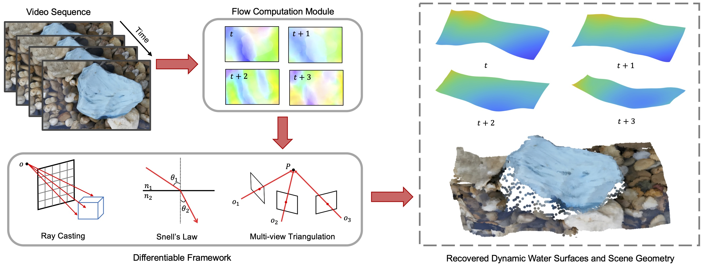

# In-the-Wild Single Camera 3D Reconstruction <br> Through Moving Water Surfaces
This is the PyTorch implementation for 2021 ICCV paper "In-the-Wild Single Camera 3D Reconstruction Through Moving Water Surfaces"
### [Project Page](https://vccimaging.org/Publications/Xiong2021MovingWater/) | [Paper](https://vccimaging.org/Publications/Xiong2021MovingWater/Xiong2021MovingWater.pdf) | [Supplemental Material](https://vccimaging.org/Publications/Xiong2021MovingWater/Xiong2021MovingWater-supp.pdf)

[In-the-Wild Single Camera 3D Reconstruction Through Moving Water Surfaces](https://vccimaging.org/Publications/Xiong2021MovingWater/Xiong2021MovingWater.pdf)  
 [Jinhui Xiong](https://jhxiong.github.io/),
 [Wolfgang Heidrich](https://vccimaging.org/People/heidriw/bio)<br>
 KAUST<br>
ICCV 2021 (Oral)


We propose a differentiable framework to estimate underwater scene geometry along with the time-varying water surface. The inputs to our model are a video sequence captured by a fixed camera. Dense correspondence from each frame to a world reference frame (selected from the input sequences) is pre-computed, ensuring the reconstruction is performed in a unified coordinate system. We feed the flow fields, together with initialized water surfaces and scene geometry (all are initialized as planar surfaces), into the framework, which incorporates ray casting, Snell’s law and multi-view triangulation. The gradients of the specially designed losses with respect to water surfaces and scene geometry are back-propagated, and all parameters are simultaneously optimized. The final result is a quality reconstruction of the underwater scene, along with an estimate of the time-varying water-air interface. The data shown here was captured in a public fountain environment.

### Prerequisite
The code was tested with python>=3.7 & PyTorch>=1.3 & cuda>=10.0 on Nvidia RTX 2080 Ti<br>
Minor change on the code if there is compatibility issue. It needs around 10 GB GPU memory.

### Setup
```
conda create -n moving_water python=3.7
conda activate moving_water

conda install pytorch torchvision -c pytorch
conda install -c conda-forge opencv scikit-image
conda install -c anaconda scipy
```

### Run the code
Please go to `example` folder, download the cached coefficient matrices (there are three matrices for each example) and execute:
```
python3 run.py
```

## Citation
```
@inproceedings{xiong2021inthewild,
  title={In-the-Wild Single Camera 3D Reconstruction Through Moving Water Surfaces},
  author={Jinhui Xiong and Wolfgang Heidrich},
  year={2021},
  booktitle={ICCV}
}
```
### Contact
Please contact Jinhui Xiong <jinhui.xiong@kaust.edu.sa> if you have any question or comment.
